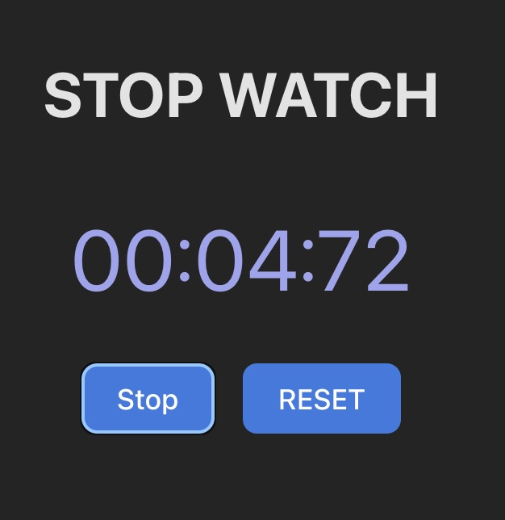

<!-- @format -->

# React stop watch

this is a simply project to practice react. Use npmp create vite.

We have a counter that starts by pressing the “Start” button and it changes to the “Stop” state and vice versa. The next button restarts the counter. I have added css styles like color, sizes. Nothing too elaborate.

